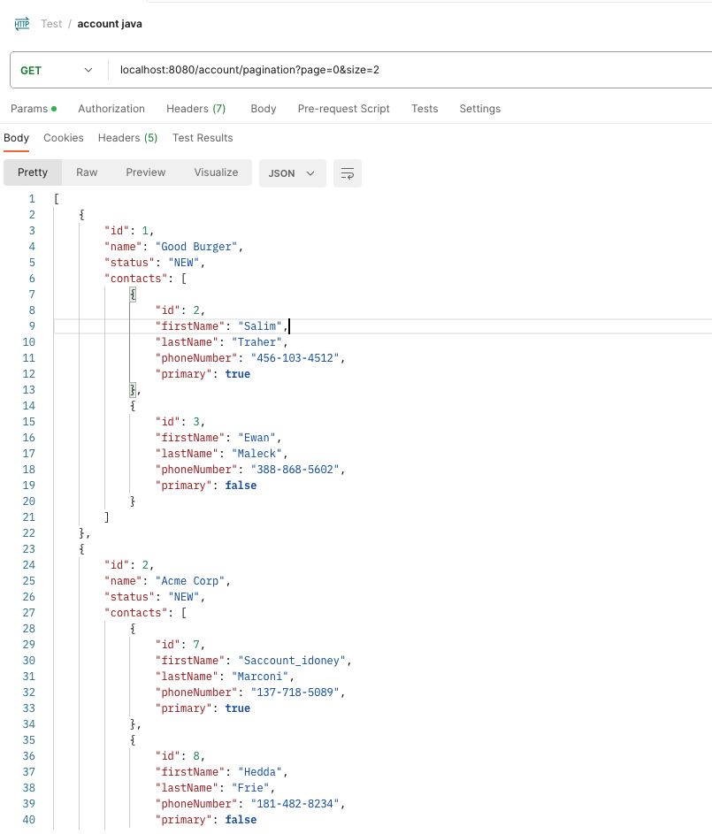
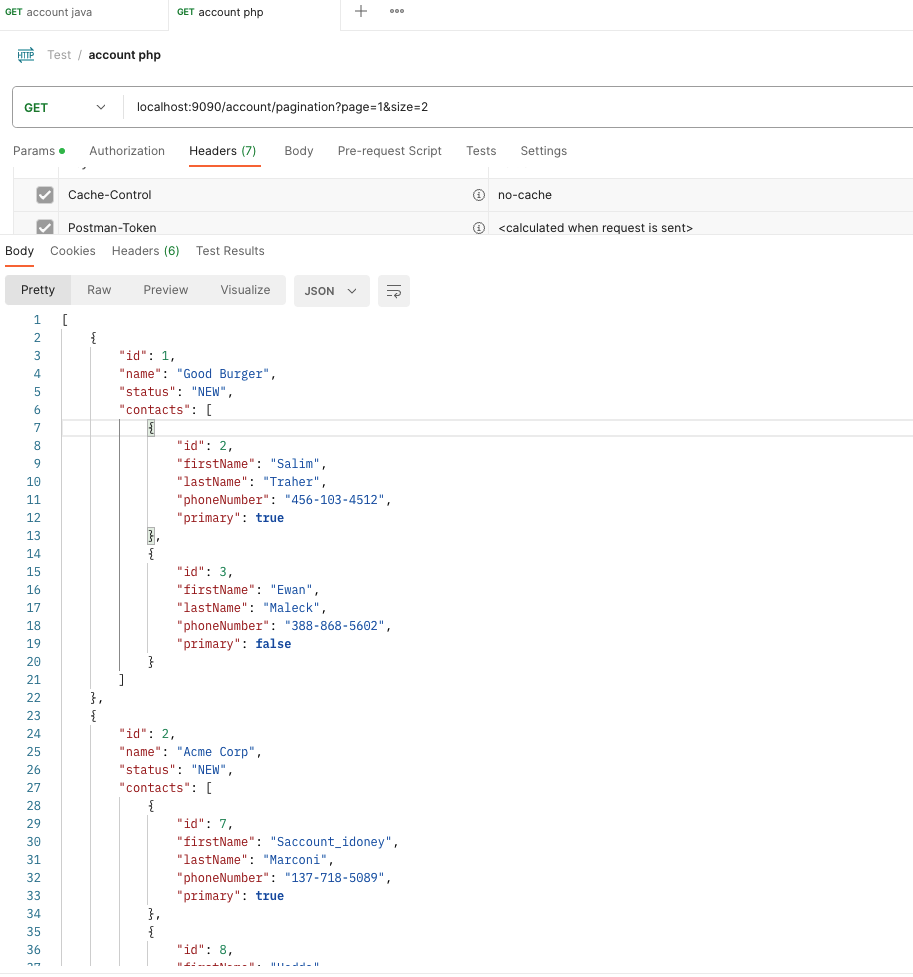
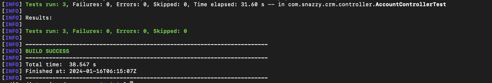

# Springboot / Symfony Demo

Welcome to Snazzy CRM, the snazziest CRM for all your CRM needs!

## Installation

### Requirements
1. Docker installed
2. An active internet connection

Then run:
```
docker compose up
```
## Backend Test

The backend test can br written in java spring boot and php symfony 

using this single script:
```
./test.sh java # or php
```

Both applications are built to be worked on while running in their docker container. The java application
will even hot reload after a code change to help you move as quickly as possible. Of course, feel free to
work on this application in any way you prefer.

The java application can be found at http://localhost:8080 and the php application at http://localhost:9090. 
Each supports the following api endpoint:

`GET /account`

returns:
```json
[
  {
    "id": 1,
    "name": "Good Burger",
    "status": "NEW"
  },
  {
    "id": 2,
    "name": "Acme Corp",
    "status": "NEW"
  },
  {
    "id": 3,
    "name": "Wonka Candy Company",
    "status": "NEW"
  },
  {
    "id": 4,
    "name": "Great Glass Elevator Corp",
    "status": "NEW"
  }
]
```

### The Demos

Your goal is to complete the following three challenges. Each one has an accompanying test that should pass 
when complete.

#### Demo 1:

The Account entity has a one-to-many relationship with the Contact entity. Add a relationship to these entities
so we now get the following:

`GET /account`

returns:
```json
[
  {
    "id": 1,
    "name": "Good Burger",
    "status": "NEW",
    "contacts": [
      {
        "id": 2,
        "firstName": "Salim",
        "lastName": "Traher",
        "phoneNumber": "456-103-4512",
        "primary": true
      },
      {
        "id": 3,
        "firstName": "Ewan",
        "lastName": "Maleck",
        "phoneNumber": "388-868-5602",
        "primary": false
      }
    ]
  },
  {
    "id": 2,
    "name": "Acme Corp",
    "status": "NEW",
    "contacts": [
      {
        "id": 7,
        "firstName": "Saccount_idoney",
        "lastName": "Marconi",
        "phoneNumber": "137-718-5089",
        "primary": true
      },
      {
        "id": 8,
        "firstName": "Hedda",
        "lastName": "Frie",
        "phoneNumber": "181-482-8234",
        "primary": false
      }
    ]
  },
  {
    "id": 3,
    "name": "Wonka Candy Company",
    "status": "NEW",
    "contacts": [
      {
        "id": 12,
        "firstName": "Freddi",
        "lastName": "Weippert",
        "phoneNumber": "588-683-6350",
        "primary": true
      },
      {
        "id": 13,
        "firstName": "Burr",
        "lastName": "Margrett",
        "phoneNumber": "993-823-2355",
        "primary": false
      }
    ]
  },
  {
    "id": 4,
    "name": "Great Glass Elevator Corp",
    "status": "NEW",
    "contacts": []
  }
]
```

#### Demo 2

We would like to allow the user to search accounts and return results that match a contact's phone number.
Alter the method `search()` in the account repository, so we now get the following:

`GET /search?query=456-103-4512`

returns:
```json
[
  {
    "id": 1,
    "name": "Good Burger",
    "status": "NEW",
    "contacts": [
      {
        "id": 2,
        "firstName": "Salim",
        "lastName": "Traher",
        "phoneNumber": "456-103-4512",
        "primary": true
      },
      {
        "id": 3,
        "firstName": "Ewan",
        "lastName": "Maleck",
        "phoneNumber": "388-868-5602",
        "primary": false
      }
    ]
  }
]
```

#### Demo 3

We would now like to make accounts filterable for ones that are not assigned contacts. Please ensure the
following now works:

`GET /search?unassigned=true`

returns:
```json
[
  {
    "id": 4,
    "name": "Great Glass Elevator Corp",
    "status": "NEW",
    "contacts": []
  }
]
```

`GET /search?unassigned=true&query=456-103-4512`

returns:
```json
[]
```


### How would you add pagination?

> Java: Use Spring Pageable interface of spring with hibernate criteria (Please see the code for implementation)
- In AccountController, added a route for pagination for input page and size
- In SearchService, added a method to call repository with pagination
- In AccountRepository, added pagination logic with hibernate criteria
- Demo: http://localhost:8080/account/pagination?page=0&size=1
- 

> Php: Use Symfony KnpPaginatorBundle to implement pagination (Please see the code for implementation)
- In AccountController, added a route for pagination for input page and size
- In SearchService, use PaginatorInterface to do pagination from repository's QueryBuilder
- In AccountRepository, use DQL to return a QueryBuilder
- Demo: http://localhost:9090/account/pagination?page=1&size=1
- 

### How do you expect performance to be impacted as more account and contact fields are made searchable?

> I will describe the cases of adding more accounts, more contacts fields (search conditions), and optimization options

- When more accounts added, pagination for accounts is required, otherwise it will be too expensive for database query
- When more search condition added, like contact addresses, phone numbers, etc, other tables needed, which means
  we need a lot of join or other logics to search, to optimize this:
    - Option 1: In database, we need to create proper index in all related tables and fields, which can significantly optimize the performance
    - Option 2: When receive a search request, search service has a method to estimate the total records of the result, if it's over the threshold in configuration,
      then send this request dto into a queue service (kafka or rabbitmq or simple redis/database queue with complex query is running in the backend server for results)
      and notify frontend to wait for a big query at realtime, once the queue is completed, depending on the frontend implementation, we can use websocket, or server-sent event to notify the frontend result.
      If less than the threshold the database server can afford, we can return the realtime data.
    - Option 3: Using elasticsearch, build a service to create indexes with documents of account and contact info in backend,
      when doing search request, use the service to call elasticsearch server for the response
- As each account returns all contacts, in this case, when we have a lot of contacts in each account it may
  cause N+1 issue in hibernate or doctrine, although, contacts are lazy loaded in the code, it creates separate sql to load contact
  info from each account. In order to optimize this:
    - Option 1: In hibernate we can add a @BatchSize(size = 10) to contacts in Account class, it can prevent N+1 issues.
      As doctrine doesn't have the same feature as @BatchSize, instead of using one-to-many
      eager loading contacts, we can create a function to manually build the contacts of account.
    - Option 2: Optimize the search requirement, if we are looking for any account, then we just return the account info,
      if we need the actual account contacts list of the found account, another account contacts request can be called,
      in this case we can use pagination for contacts and this will improve the performance.

### Others
- Added Symfony framework acting the same functions as Java Springboot
- Add docker containers of symfony into docker-composer.yml
- Search features as well as pagination implemented for demo purpose
- Unit tests added with the same tests as Java springboot
- Unit tests:
> ./test.sh java



> ./test.sh php


